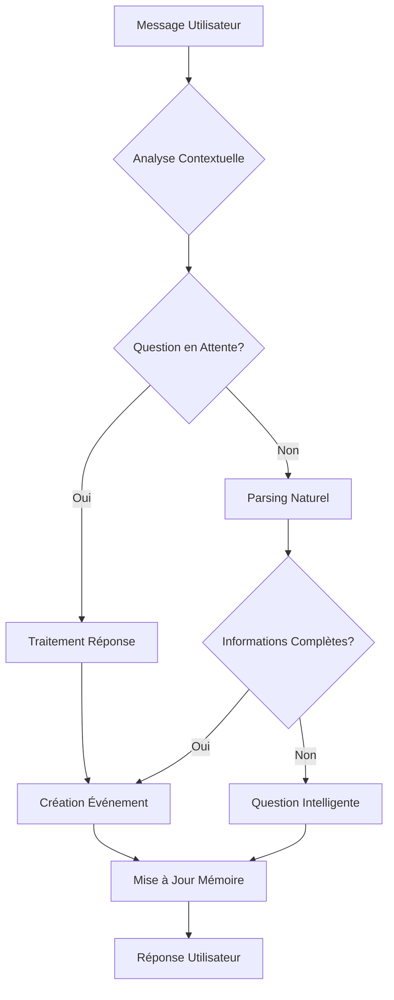

# 🤖 Assistant IA Calendrier - Substy AI

## 📋 Description

Substy AI est un assistant personnel intelligent qui comprend le langage naturel français pour gérer automatiquement votre calendrier. L'IA analyse vos messages, pose des questions intelligentes quand des informations manquent, et crée des événements de calendrier de manière contextuelle.

## ✨ Fonctionnalités Principales

### 🗣️ **Compréhension du Langage Naturel**
- Analyse des expressions temporelles françaises
- Détection d'intentions (création, modification, suppression d'événements)
- Gestion des corrections et négations ("bah c'est pas demain")
- Support des expressions familières ("ce soir", "vendredi pro", "semaine prochaine")

### 🧠 **Mémoire Conversationnelle**
- Mémorisation du contexte entre les messages
- Suivi des questions posées et réponses attendues
- Gestion des événements en cours de création
- Historique des interactions utilisateur

### 📅 **Gestion Intelligente du Calendrier**
- Création automatique d'événements avec catégorisation
- Détection et gestion des conflits d'horaires
- Calcul intelligent des dates (jours de la semaine, "prochain", etc.)
- Génération de titres contextuels

## 🏗️ Architecture Technique

### **Frontend** (React + TypeScript)
```
src/frontend/
├── components/
│   ├── ChatMessage.tsx      # Affichage des messages
│   ├── ChatInput.tsx        # Saisie utilisateur
│   ├── EventCard.tsx        # Cartes d'événements
│   └── TypingIndicator.tsx  # Animation de frappe
├── hooks/
│   └── useChat.ts          # Logique de communication
└── types/
    └── index.ts            # Interfaces TypeScript
```

### **Backend** (Express + LangGraph)
```
src/
├── server.ts              # Serveur Express
├── agent.ts              # Agent IA principal
├── calendar.ts           # Gestion du calendrier
├── memoryStore.ts        # Système de mémoire
└── openrouter.ts         # Interface IA
```

## 🤖 Système de Raisonnement de l'IA

### **1. Pipeline de Traitement**



### **2. Détection d'Intentions**

#### **Création d'Événements**
```typescript
// Patterns détectés automatiquement
"j'ai rdv dentiste demain 15h"     → Création directe
"restaurant ce soir 21h"           → Création directe  
"vol vendredi prochain"            → Question d'heure
"tennis avec Paul demain"          → Question d'heure
```

#### **Modifications/Corrections**
```typescript
// Détection de corrections
"bah c'est pas demain c'est jeudi" → Correction détectée
"non, c'est à 15h"                 → Modification d'heure
```

#### **Suppressions**
```typescript
// Patterns de suppression
"annule le repas de ce soir"       → Suppression ciblée
"retire mon rdv dentiste demain"   → Suppression directe
```

### **3. Système de Mémoire Avancé**

#### **Mémoire Factuelle**
- Stockage des informations personnelles mentionnées
- Historique des événements créés
- Préférences et habitudes détectées

#### **Mémoire Conversationnelle**
```typescript
interface ConversationContext {
  lastQuestion?: string;              // "À quelle heure décolle votre avion ?"
  lastQuestionType?: "time" | "date"; // Type de réponse attendue
  pendingEvent?: {                    // Événement en cours de création
    title: string;                    // "Vol"
    day: string;                      // "vendredi prochain"
    category: string;                 // "Transport"
    originalRequest: string;          // Message original
  };
  awaitingResponse?: boolean;         // En attente de réponse
}
```

### **4. Parsing Temporel Intelligent**

#### **Expressions Supportées**
```typescript
// Jours relatifs
"demain", "aujourd'hui", "ce soir"

// Jours de la semaine
"lundi prochain", "vendredi pro", "mardi 15h"

// Expressions familières  
"semaine prochaine", "le week-end", "dans 3 jours"

// Heures
"15h", "midi", "soir" (→ 20h), "matin" (→ 9h)
```

#### **Calcul de Dates**
```typescript
// Exemple: "vendredi prochain"
const currentDay = now.getDay();        // Ex: 2 (mardi)
const targetDay = weekDays.indexOf("vendredi"); // 5
let daysToAdd = targetDay - currentDay; // 3
daysToAdd += 7; // +7 pour "prochain" → 10 jours
```

### **5. Catégorisation Automatique**

```typescript
const categories = {
  "Sport": ["tennis", "foot", "gym", "course"],
  "Médical": ["dentiste", "médecin", "rdv médical"],
  "Travail": ["réunion", "meeting", "boulot"],
  "Social": ["restaurant", "ami", "anniversaire"],
  "Transport": ["vol", "avion", "train", "bus"]
};
```

### **6. Gestion des Conflits**

```typescript
// Détection automatique
const conflicts = Calendar.conflicts(start, end);

if (conflicts.length > 0) {
  return "⚠️ Conflit détecté : vous avez déjà un événement...";
}
```

## 🎯 Exemples d'Interactions

### **Conversation Typique**

```
👤 j'ai mon vol vendredi prochain
🤖 À quelle heure décolle votre avion ?

👤 14h  
🤖 ✈️ Vol ajouté à votre calendrier pour vendredi prochain à 14h !
```

### **Correction d'Information**

```
👤 rdv dentiste demain 10h
🤖 ✅ Rdv dentiste noté pour demain à 10h

👤 bah c'est pas demain c'est jeudi prochain
🤖 Compris ! Je modifie le rdv dentiste pour jeudi prochain. Toujours à 10h ?

👤 oui
🤖 ✅ Rdv dentiste modifié pour jeudi prochain à 10h !
```

### **Gestion des Conflits**

```
👤 restaurant ce soir 20h
🤖 ⚠️ Conflit détecté : vous avez déjà "Tennis avec Paul" ce soir à 20h.
    Voulez-vous quand même ajouter "Restaurant" ?

👤 non, plutôt 21h
🤖 ✅ Restaurant noté pour ce soir à 21h !
```

## 🔧 Installation et Démarrage

### **Prérequis**
- Node.js 18+
- npm ou yarn

### **Installation**
```bash
git clone [repo-url]
cd substy-ai
npm install
```

### **Configuration**
Créer un fichier `.env` :
```env
OPENROUTER_API_KEY=your_api_key_here
PORT=3000
```

### **Démarrage**
```bash
npm run dev
```

L'application sera accessible sur `http://localhost:5173`

## 📁 Structure des Données

### **Événements** (`data/events.json`)
```json
{
  "id": "uuid",
  "title": "Rdv dentiste", 
  "start": "2024-01-15T10:00:00.000Z",
  "end": "2024-01-15T11:00:00.000Z",
  "category": "Médical",
  "color": "#ef4444",
  "description": "Médical: Rdv dentiste"
}
```

### **Mémoire** (`data/memory.json`)
```json
{
  "id": "uuid",
  "text": "j'ai rdv dentiste demain 15h",
  "timestamp": 1703123456789,
  "type": "fact",
  "context": "Événement: Dentiste pour demain"
}
```

### **Contexte** (`data/conversation_context.json`)
```json
{
  "lastQuestion": "À quelle heure décolle votre avion ?",
  "lastQuestionType": "time",
  "awaitingResponse": true,
  "pendingEvent": {
    "title": "Vol",
    "day": "vendredi prochain", 
    "category": "Transport",
    "originalRequest": "j'ai mon vol vendredi prochain"
  }
}
```

## 🧪 Mode Démonstration

En l'absence de clé API, l'IA fonctionne en mode démonstration avec :
- Réponses simulées intelligentes
- Détection de patterns préconfigurés
- Création d'événements basée sur des règles
- Questions contextuelles automatiques

## 🎨 Interface Utilisateur

### **Design Moderne**
- Interface glassmorphisme avec effets de flou
- Thème sombre élégant
- Animations fluides et microinteractions
- Design responsive

### **Composants**
- **Chat Interface** : Messages en temps réel avec typing indicator
- **Calendar View** : Affichage des événements avec codes couleur
- **Event Cards** : Cartes d'événements avec catégorisation visuelle

## 🔮 Roadmap

### **Améliorations Prévues**
- [ ] Support des événements récurrents
- [ ] Intégration calendriers externes (Google, Outlook)
- [ ] Rappels intelligents
- [ ] Analyse de productivité
- [ ] Support vocal
- [ ] Multi-langues

### **IA Avancée**
- [ ] Apprentissage des préférences utilisateur
- [ ] Suggestions proactives d'événements
- [ ] Optimisation automatique du planning
- [ ] Détection d'humeur et adaptation

---